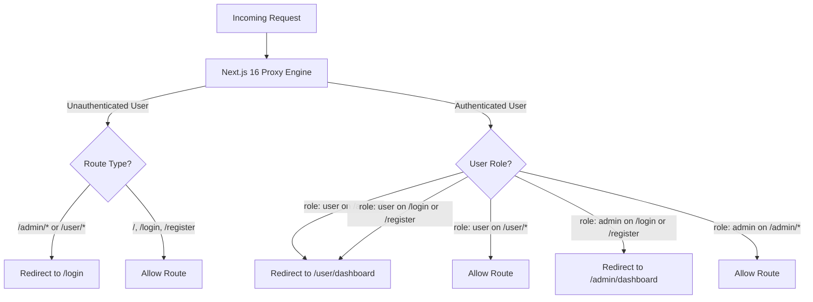

# Product Requirements Document (PRD)
## SwiftRide AI — Luxury & Smart Car Rental Platform

---

## 1. Executive Summary & Vision

SwiftRide AI is an enterprise-grade car rental platform engineered with modern web standards, autonomous AI assistance, and real-time database management. Built on Next.js 16 (App Router with Turbopack), React 19, TypeScript, Tailwind CSS v4, and Supabase (PostgreSQL with Realtime WebSockets), SwiftRide AI delivers a streamlined vehicle discovery, quotation, and instant booking experience for luxury, SUV, and economy car rentals.

- **Live URL:** [https://swiftride-ai.vercel.app/](https://swiftride-ai.vercel.app/)
- **Repository:** [https://github.com/shakil-ahmed-billal/swiftride-ai](https://github.com/shakil-ahmed-billal/swiftride-ai)

---

## 2. Target Audience & Personas

1. **Renter / Customer (End-User):**
   - Individuals seeking accessible or luxury vehicles for business travel, vacations, or daily commutes.
   - Requires instant answers on deposits, pricing, vehicle specifications, and frictionless in-chat or on-page reservation.
2. **Fleet Operations & Admin Manager:**
   - Business administrators managing vehicle inventory, daily rental rates, reservation statuses, customer leads, and sales growth metrics.

---

## 3. Technology Stack & Architecture

| Layer | Technology | Purpose |
| :--- | :--- | :--- |
| **Framework** | Next.js 16.3.3 (App Router + Turbopack) | Server and client component rendering, route handlers |
| **Language** | TypeScript 5 | Static type safety and data contract enforcement |
| **Frontend** | React 19.2.8 + Zustand 5 | State management, UI reactivity, component lifecycle |
| **Styling** | Tailwind CSS v4 + Vanilla CSS Tokens | Responsive grid systems, modern typography, glassmorphic styling |
| **Database & Auth** | Supabase (PostgreSQL + Realtime WebSocket) | Persistent data store, Row-Level Security, authentication sessions |
| **AI Engines** | Google Gemini 3.6/Flash + OpenRouter Multi-LLM | Intelligent conversational agent with three-tier fallback |
| **Notifications** | Discord Webhooks | Real-time automated notifications for qualified sales leads |
| **Deployment** | Vercel | Global edge content delivery and continuous integration |

---

## 4. Key Functional Modules

### 4.1. Visual Fleet Catalog & Filtering (`PopularCars.tsx`, `Hero.tsx`)
- **Category Tabs:** Filter vehicle cards by Popular, Large Car, Small Car, and Exclusive/Luxury Cars.
- **Dynamic Search Overlay:** 50% overlapping hero filter with Pickup/Drop-off locations, dates, and time selectors.
- **Real-Time Booking Drawer:** Slide-over modal with driver details, auto-filled verified account email, date duration, and price calculator.
- **Favoriting System:** Interactive heart toggles with localized state updates.

### 4.2. SwiftRide AI Concierge Assistant (`ChatWidget.tsx`, `/api/ai/chat`)
- **Three-Tier Fallback Architecture:**
  1. Tier 1: Google Gemini AI (Flash 3.6 / 1.5) with live inventory database injection.
  2. Tier 2: OpenRouter API (Llama 3.3 70B, Gemini 2.0 Flash, GPT-3.5 Turbo) fallback.
  3. Tier 3: Smart Local Conversational Engine for offline resilience.
- **Contextual In-Chat Car Booking:** Asking questions like *"I want to book this car, please provide the booking form"* or *"reserve this vehicle"* automatically detects the discussed car and opens an inline reservation form.
- **Markdown Image Rendering:** Visual car previews rendered natively inside chat bubbles.
- **Lead Qualification & Webhook:** Automatically extracts names, phone numbers, and emails to dispatch alerts to Discord sales channels.

### 4.3. User Portal & Real-Time Dashboard (`/user/dashboard`)
- **Real-Time WebSocket Subscription:** Supabase Postgres Changes channel listening to instant booking inserts.
- **Email-Matched Live Records:** Wildcard case-insensitive queries (`.ilike('customer_email', ...)`).
- **Verified Rental Agreements & Digital Receipts:** Modal view with transaction IDs, vehicle details, duration, and download triggers.
- **Trip Spotlight Card:** Real-time visual indicator of active reservations.

### 4.4. Admin Operations Hub (`/admin/dashboard`)
- **Metric Cards:** Total revenue, active rentals, pending approvals, and fleet occupancy rate.
- **Fleet Management:** Live stock status, add/edit vehicle pricing, and availability switches.
- **Recent Transactions & POS View:** Global and regional sales distributions with graphical growth trends.

---

## 5. Security & Route Protection (`proxy.ts`)

Next.js 16 Proxy specification implemented in `src/proxy.ts` with double-layer client layout guards:



---

## 6. Database Schema Specifications (Supabase PostgreSQL)

### 6.1. `cars` Table
```sql
CREATE TABLE public.cars (
  id TEXT PRIMARY KEY,
  name TEXT NOT NULL,
  brand TEXT NOT NULL,
  type TEXT NOT NULL,
  transmission TEXT NOT NULL,
  fuel_type TEXT NOT NULL,
  seats INTEGER NOT NULL,
  price_per_day NUMERIC NOT NULL,
  image TEXT NOT NULL,
  available BOOLEAN DEFAULT true,
  sales_count INTEGER DEFAULT 0,
  rating NUMERIC DEFAULT 5.0,
  created_at TIMESTAMPTZ DEFAULT now()
);
```

### 6.2. `bookings` Table
```sql
CREATE TABLE public.bookings (
  id UUID DEFAULT gen_random_uuid() PRIMARY KEY,
  customer_name TEXT NOT NULL,
  customer_email TEXT NOT NULL,
  country TEXT DEFAULT 'United States',
  car_id TEXT REFERENCES public.cars(id),
  car_name TEXT NOT NULL,
  car_image TEXT NOT NULL,
  start_date TIMESTAMPTZ DEFAULT now(),
  end_date TIMESTAMPTZ DEFAULT now() + interval '3 days',
  duration TEXT NOT NULL,
  total_amount NUMERIC NOT NULL,
  payment_method TEXT DEFAULT 'Credit Card',
  transaction_id TEXT UNIQUE NOT NULL,
  status TEXT DEFAULT 'Success',
  created_at TIMESTAMPTZ DEFAULT now()
);
```

### 6.3. `leads` Table
```sql
CREATE TABLE public.leads (
  id UUID DEFAULT gen_random_uuid() PRIMARY KEY,
  name TEXT NOT NULL,
  email TEXT NOT NULL,
  phone TEXT NOT NULL,
  notes TEXT,
  is_qualified BOOLEAN DEFAULT true,
  created_at TIMESTAMPTZ DEFAULT now()
);
```

---

## 7. Non-Functional Requirements

- **Zero Build Warnings:** Image aspect ratio adherence via `style={{ width: "auto", height: "auto" }}` and `data-scroll-behavior="smooth"`.
- **Security Rule Directives:** Strictly zero hardcoded API keys inside source files; credentials strictly read from environment variables.
- **Performance:** Sub-100ms response times for database queries; instant optimistic updates for UI states.
- **Responsiveness:** Fully responsive across iOS, Android, tablets, and desktop resolutions.
